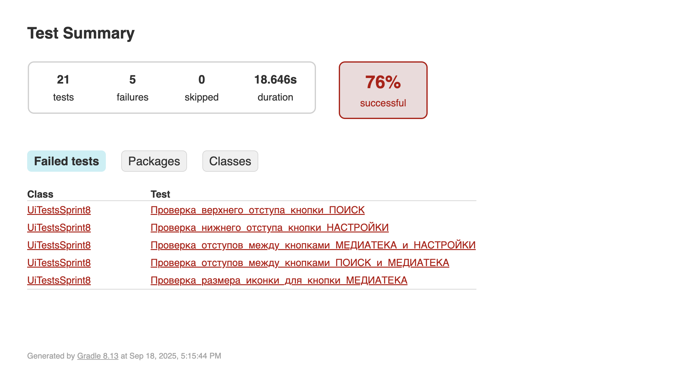
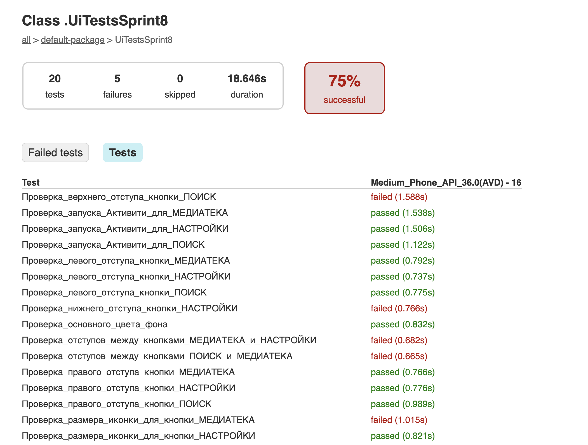
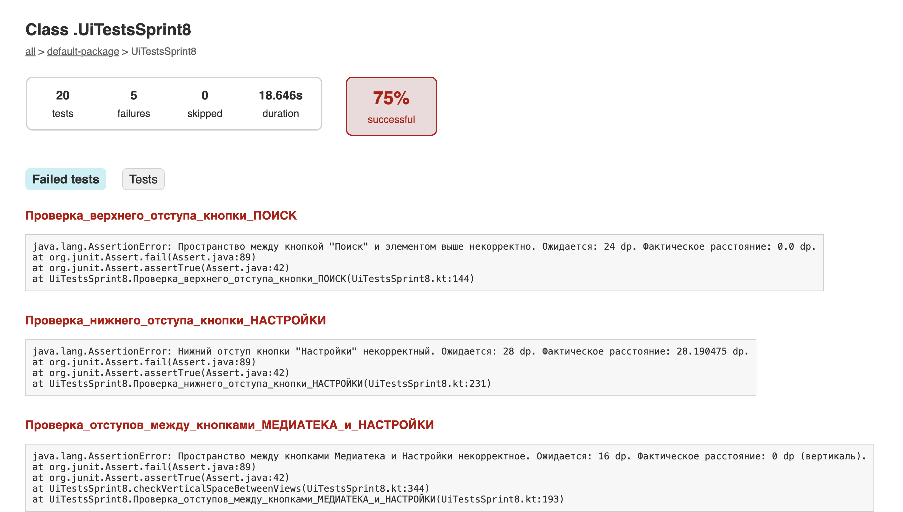

# **Руководство по использованию UI-тестов 🤖**

Этот файл содержит руководство по настройке и запуску UI-тестов для Android-приложения. Тесты написаны на Kotlin с использованием фреймворков Espresso и JUnit4 и позволяют автоматически проверять верстку, отступы, форматирование текста и навигацию по экранам.

## **🚀 Настройка проекта**

Для использования тестов в проекте студента необходимо добавить соответствующие зависимости в файл `build.gradle.kts` приложения.

### **1\. Добавление зависимостей**

В блок `dependencies` проекта студента `app/build.gradle.kts` добавьте следующие строки:

	dependencies {   
		...
	    androidTestImplementation("androidx.test.ext:junit:1.3.0")
	    androidTestImplementation("androidx.test.espresso:espresso-intents:3.7.0")
	    androidTestImplementation("androidx.test.espresso:espresso-core:3.7.0")  
	}

### **2\. Конфигурация Gradle**

В блоке `android` файла `app/build.gradle.kts` необходимо настроить тестовый раннер и передачу аргументов.

	android {  
   		...
	    defaultConfig {  
	    	...
		    testInstrumentationRunner = "androidx.test.runner.AndroidJUnitRunner"
	        testInstrumentationRunnerArguments["clearPackageData"] = "true"
	        testInstrumentationRunnerArguments["activityClass"] = project.findProperty("activityClass") as? String ?: ""  
	    }
 
	}

## **🛠️ Перенос и адаптация тестов**

Переместите ваш файл с тестами (`app/src/androidTest/java/ru/yandex/practicum/uitestsforpracticum/UiTestsSprint8.kt`) в директорию `src/androidTest/java/` проекта студента. (Для стабильности лучше удалить все остальные файлы с тестами из этой директории)  

## **🚀 Запуск тестов из командной строки**

Вы можете запускать тесты, указывая имя Activity, которое нужно тестировать, через командную строку. Это делает тесты гибкими и многоразовыми.

**ВАЖНО** Андроид эмулятор должен быть запущен перед запуском тестов.

### **Синтаксис команды**

Используйте задачу Gradle connectedAndroidTest с параметром \-P.

./gradlew connectedAndroidTest \-PactivityClass=com.your\_company.your\_package.MainActivity

* **com.your\_company.your\_package.MainActivity**: Замените на полный путь к MainActivity, которое вы хотите протестировать. К примеру com.example.playlistmaker.MainActivity

### **Просмотр результатов**

После завершения тестов Gradle автоматически сгенерирует подробный HTML-отчет. Отчет будет находиться в следующей директории:

* app/build/reports/androidTests/connected/debug/index.html

Откройте этот файл в браузере, чтобы увидеть наглядную таблицу с результатами всех тестов.

### **Ограничения**
* на данный момент растояние между UI елементами проверяются по фактическим отстуам. То есть если 2 елемента расположены друг под другом и у обоих установлен padding вместо margin для создания отступов между ними, то тесты посчитают расстояние как 0 и выдадут ошибку.
* основной цвет фона проверяется для первого, смого внешнего layout. Это значит что если студент обернул контент экрана в несколько ViewGroup и установил цвет фона на внутреннем layout, то тесты выдадут ошибку.
* сейчас тесты написаны только для светлой темы.

### **Пример отчета**

